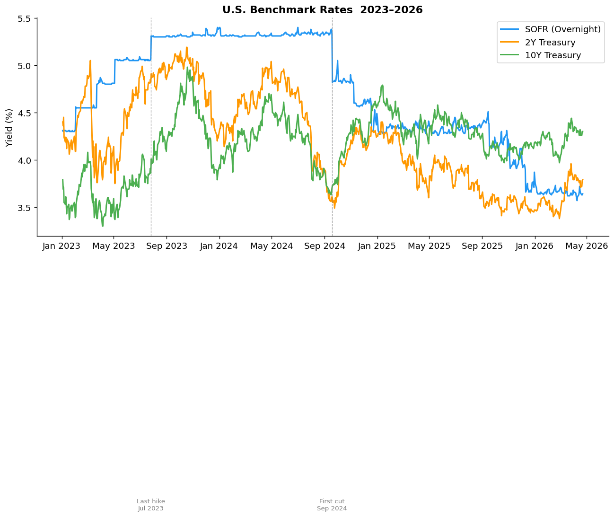
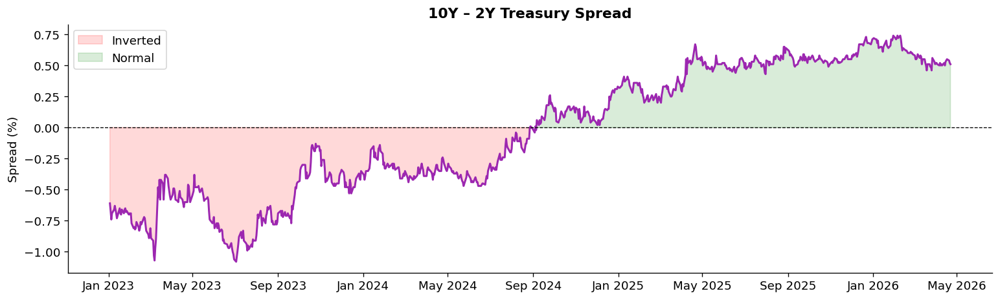
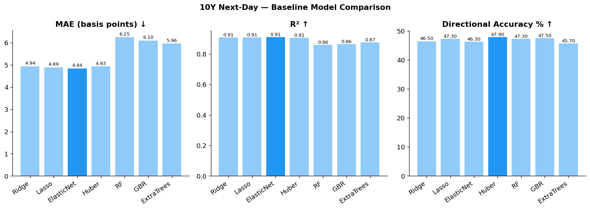
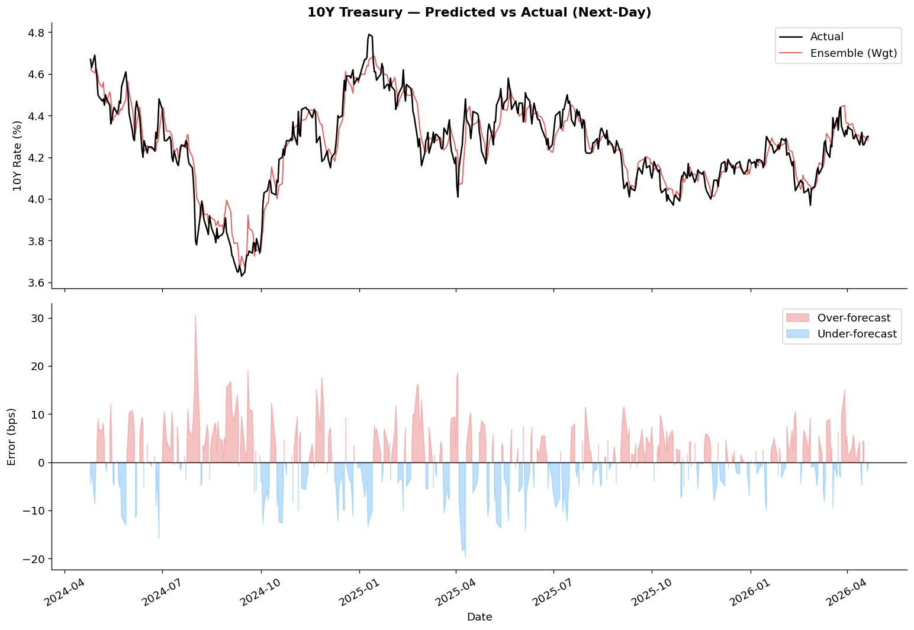
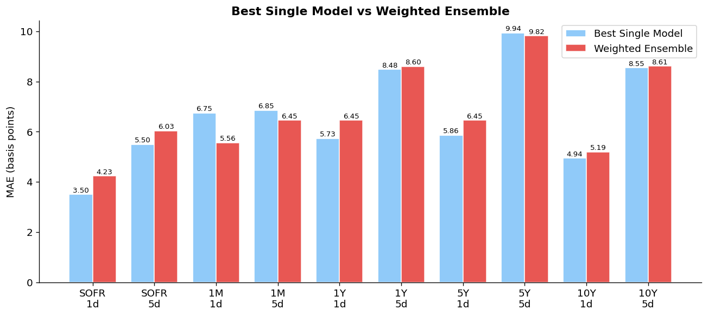
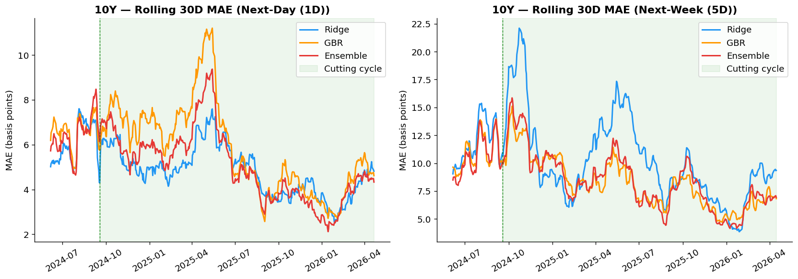
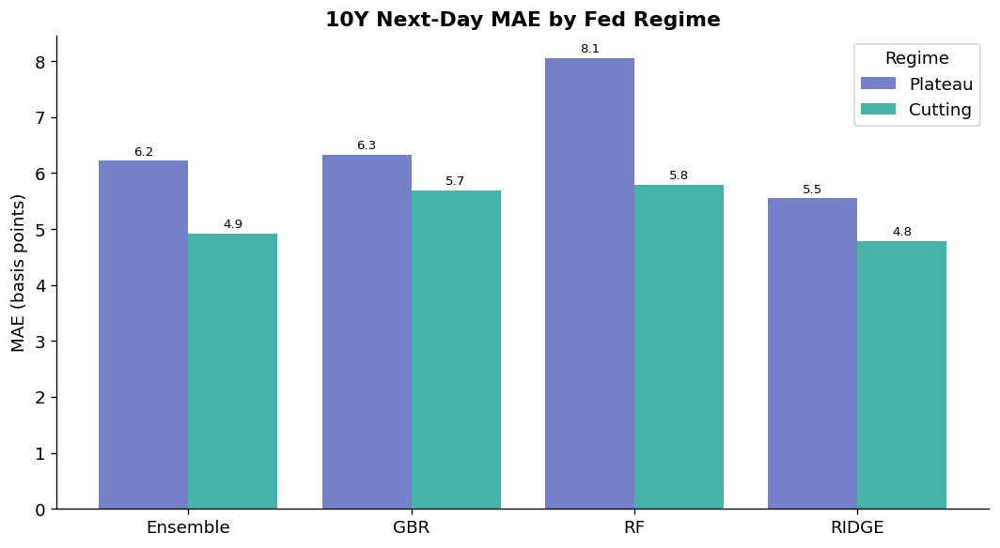

# Treasury Rate Forecasting

A machine learning pipeline that forecasts U.S. Treasury yields one day and one week ahead, built on daily data from the U.S. Treasury and the Federal Reserve (FRED).

**Rates covered:** SOFR · 1M T-Bill · 1Y · 5Y · 10Y Treasury

---

## The Rate Environment



The data covers a full policy cycle — aggressive Fed hikes through mid-2023, a plateau near 5.5%, then the first cut in September 2024. The 10Y–2Y curve inverted for most of the period, which compressed net interest margins across the banking system.



---

## How It Works

**Data** is pulled daily from two sources with a single command (`python -m treasury_forecasting`):
- U.S. Treasury API — full yield curve (1M → 30Y)
- FRED API — SOFR, Fed Funds, VIX, credit spreads, oil prices

**Features** fall into four groups:
- Yesterday's rate levels (strongest single predictor — rates are persistent)
- Curve spreads (10Y–2Y, 2Y–SOFR, 10Y–3M)
- Rolling averages and volatility (5-day and 20-day)
- Macro context (VIX, high-yield spreads, WTI oil)

**Walk-forward backtest** — the model trains on one year of history, predicts one step ahead, then adds that day to its training window and repeats. No future data ever leaks into training.

---

## Model Exploration

Seven models were compared on identical backtests:



Ridge Regression and Gradient Boosting emerged as the strongest. The best configurations from each were tuned (Ridge: regularization strength sweep; GBR: learning rate × tree depth grid) before being combined into an ensemble.

---

## Results



The weighted ensemble (each model weighted by its inverse error) tracks the 10Y rate closely, with errors centered near zero and no systematic bias.

**Next-day MAE (basis points):**

| Rate | Best Single Model | Ensemble |
|---|---|---|
| SOFR | ~2–3 bps | ✓ matches or beats |
| 1Y Treasury | ~3–5 bps | ✓ matches or beats |
| 5Y Treasury | ~4–6 bps | ✓ matches or beats |
| 10Y Treasury | ~4–6 bps | ✓ matches or beats |

*1 basis point = 0.01%. A 5 bps next-day error is very small relative to typical daily moves of 5–15 bps.*



The ensemble consistently matches or beats the best single model across all rates and horizons.

---

## Stability Over Time



Errors are stable during the plateau period (Aug 2023 – Sep 2024) when rates barely moved. They rise during the cutting cycle as the model adapts to a new rate environment.

---

## Regime Breakdown



Performance is best during the **Plateau** (stable rates, easy to predict) and higher during **Cutting** (shifting dynamics). This is expected — models trained on a stable environment are slower to adapt when the Fed starts moving rates again.

---

## What I'd Do Next

- **Longer history** — extend to 2018+ to capture a full prior hiking cycle
- **Uncertainty bands** — add confidence intervals around point forecasts for risk management use
- **MOVE index** — add options-implied rate volatility as a feature
- **Repo spreads** — extend the same framework to SOFR percentiles and repo rates

---

## Project Structure

```
treasury_forecasting/
├── src/treasury_forecasting/
│   ├── data_ingest.py       # Treasury yield curve ETL
│   ├── fred_data.py         # FRED macro data ETL
│   └── validation.py        # Data quality checks
├── notebooks/
│   ├── 01_rate_environment.ipynb
│   ├── 02_feature_engineering.ipynb
│   ├── 03_model_exploration.ipynb
│   └── 04_ensemble_and_results.ipynb
├── data/
│   ├── daily_treasury_yield_curve.csv
│   ├── model_features_daily.csv
│   ├── engineered_features.csv
│   └── predictions/         # Walk-forward prediction CSVs
├── models/                  # Fitted model files (.joblib)
└── images/                  # Charts exported from notebooks
```
